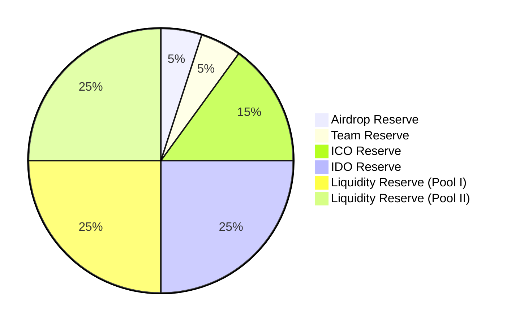
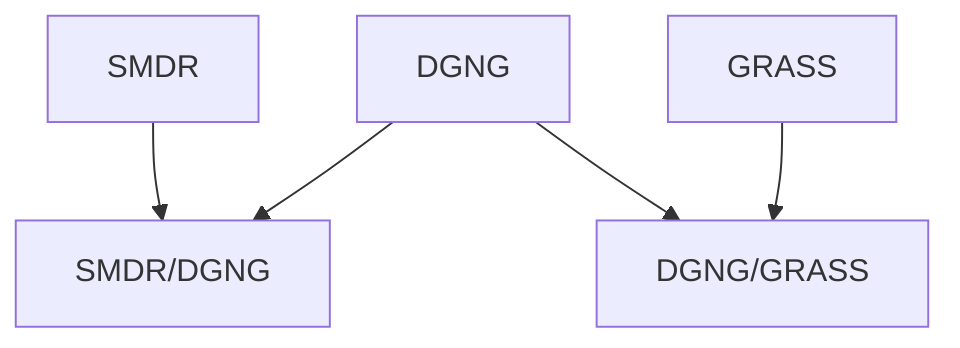

# Dugong
<b>Dugong</b> Token (<b>$DGNG</b>) is the foundational currency of the Ecosystem that allows investors to hold millions or billions of it in their wallets and it is themed as a marine mammal, which was hunted to extinction in the 18th century (also known as sea cow).

## Token Details:
&bull; Name: Dugong 
&bull; Symbol: DGNG 
&bull; Decimals: 18 
&bull; Inital Supply: 1,000,000,000,000 
&bull; Maximum Supply: 500,000,000,000 
&bull; Minimum Supply: 300,000,000,000  

## Tokenomics (Token Distribution Plan):
&bull; Airdrop Reserve: 5% 
&bull; Team Reserve: 5% 
&bull; ICO Reserve: 15% 
&bull; IDO Reserve: 25% 
&bull; Liquidity Reserve: 50% 
&nbsp; &nbsp; &bull; &bull; Liquidity Reserve (Pool I: DGNG/GRASS, 2:3): 25% 
&nbsp; &nbsp; &bull; &bull; Liquidity Reserve (Pool II: DGNG/SMDR, 2:5): 25% 

## Taxation:
$DGNG is a Tax-Free Token, there is no taxation on buy/sell/transfer of tokens. 

## Liquidity Pools:

